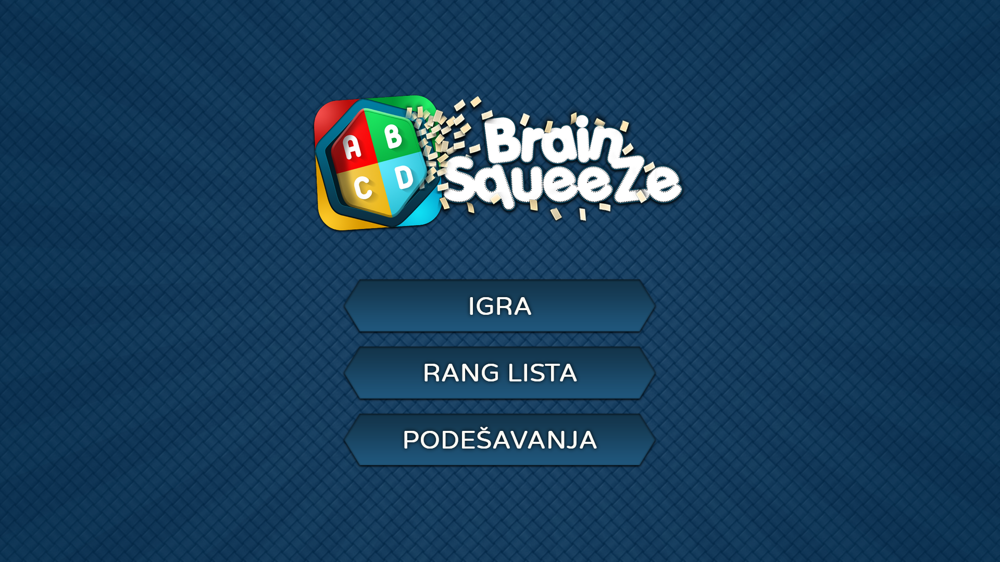
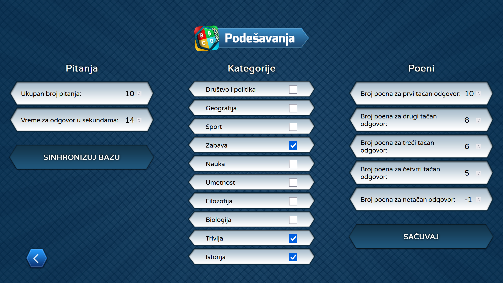
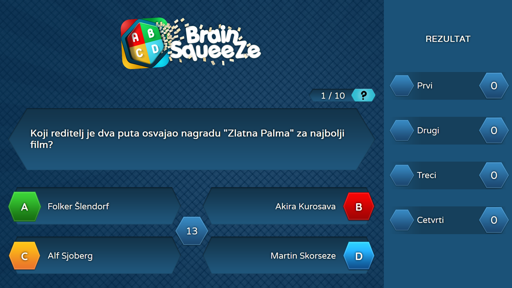

# BrainSqueeze

Quiz made for booth and promotional use by VTŠ Apps Team.

## Prerequisites:

- NodeJS (used v20.18.1)
- MongoDB Community Server (used v7.0.15)
- Create a `.env` file. Here is an example for local development:

```
# Database
MONGODB_URL="mongodb://localhost:27017/kviz_baza"

# NodeJS Port
PORT=8000
```

Change the port and connection string as needed.

## Instructions:

- **Command line (Windows)**

  - Open a terminal in the root directory
  - Run the command `npm run setup:windows`

- **Manual (Windows)**

  - Navigate to the `scripts` folder
  - Run `start-mongo-windows.bat`

- **Starting the quiz**
  - Run the command `npm run dev` for development
  - Run the command `npm run prod` for production (minifies the files)

##




